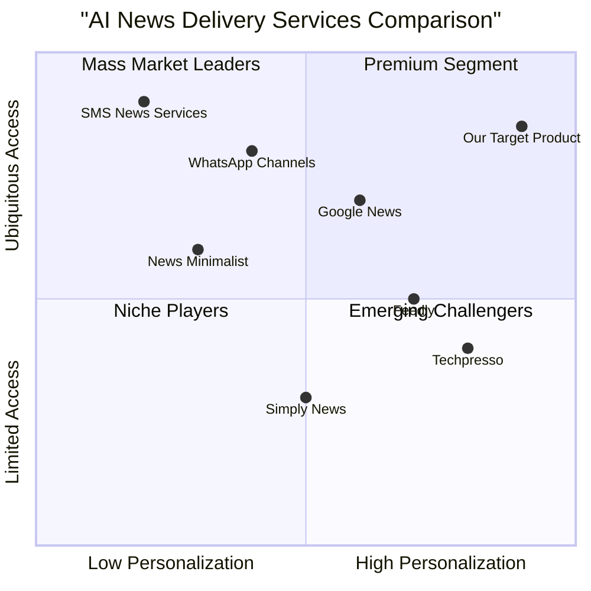
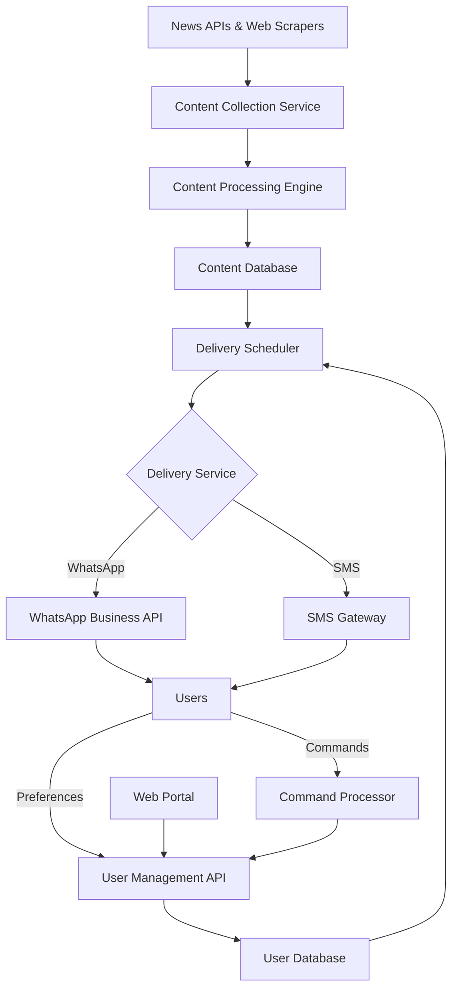

# Product Requirements Document (PRD)

## AI News Agent: Real-time AI Technology Updates via WhatsApp/SMS

**Date**: May 26, 2025  
**Author**: Emma, Product Manager  
**Version**: 1.0

## Original Requirements
Create an AI agent that sends users hot news regarding new AI technology via WhatsApp or SMS, including features like news source selection, content filtering capabilities, frequency of updates, notification preferences, and user subscription management.

## 1. Product Definition

### 1.1 Product Goals
- Deliver timely, relevant AI technology news to users through accessible messaging channels (WhatsApp/SMS)
- Provide highly personalized news content filtering based on user preferences and interests
- Create a frictionless subscription and management experience with minimal setup complexity

### 1.2 User Stories

1. **As a** busy AI researcher, **I want** to receive curated updates about breakthroughs in my specific field of interest **so that** I can stay informed without spending hours searching through news sites.

2. **As a** technology professional, **I want** to customize exactly which AI topics I receive notifications about **so that** I only get information relevant to my work and interests.

3. **As a** non-technical business leader, **I want** to receive simplified explanations of important AI developments **so that** I can understand potential business impacts without technical jargon.

4. **As a** mobile user with limited data, **I want** to receive text-only updates via SMS **so that** I can stay informed without using excessive data or requiring a smartphone.

5. **As a** user with changing interests, **I want** to easily modify my subscription preferences **so that** I can adjust the content I receive as my needs change.

### 1.3 Competitive Analysis

| Product | Pros | Cons |
|---------|------|------|
| **Techpresso** | - High-quality AI news curated by experts - Used by professionals at major tech companies - Combines ML with human curation | - No WhatsApp/SMS delivery option - Limited personalization - No frequency control |
| **Google News** | - Powerful recommendation algorithms - Comprehensive news coverage - Free service | - Not specialized in AI news - No direct messaging delivery - Limited filtering options |
| **Feedly** | - Topic and trend identification - RSS integration - Good organization tools | - No direct WhatsApp/SMS delivery - Requires separate app - Limited free tier |
| **News Minimalist** | - Clean, distraction-free interface - Covers essential news only - Simple user experience | - Not AI-focused - Limited customization - No direct messaging delivery |
| **Simply News** | - Audio format option - AI-powered summaries - Hands-free consumption | - Audio only - No messaging platform integration - Limited personalization |
| **WhatsApp Channels** | - Native WhatsApp integration - Large user base - Rich media support | - One-way communication - Limited filtering options - No AI specialization |
| **Traditional SMS News Services** | - Works on any mobile phone - No internet required - Simple interface | - Text only - Character limits - Limited personalization |

### 1.4 Competitive Quadrant Chart

## 2. Technical Specifications

### 2.1 Requirements Analysis

The AI News Agent will be a cloud-based service that collects, filters, and delivers AI technology news to subscribers via WhatsApp Business API and SMS gateways. The system requires several key components:

1. **News Collection System**: APIs and web scrapers to gather AI news from diverse sources
2. **Content Processing Engine**: AI-powered analysis for categorization, summarization, and relevance scoring
3. **User Preference Database**: Secure storage of user preferences and subscription settings
4. **Messaging Interface**: Integration with WhatsApp Business API and SMS gateways
5. **Management Portal**: Web interface for users to manage their subscriptions and preferences
6. **Analytics System**: Tools to track engagement and optimize content delivery

### 2.2 Requirements Pool

#### P0 (Must-have)

1. **News Source Integration**
   - MUST integrate with at least 5 major AI news sources/APIs
   - MUST update news database at least hourly
   - MUST support article deduplication to prevent redundant notifications

2. **Content Filtering**
   - MUST allow users to select specific AI topics of interest (e.g., LLMs, computer vision, robotics)
   - MUST support keyword-based filtering
   - MUST include relevance scoring to prioritize high-impact news
   - MUST filter out sponsored/promotional content unless explicitly opted-in

3. **Delivery Channels**
   - MUST support WhatsApp message delivery
   - MUST support SMS message delivery
   - MUST handle delivery failures with retry logic

4. **User Management**
   - MUST provide simple subscription process via WhatsApp or SMS
   - MUST support basic commands via message replies (e.g., "pause", "help")
   - MUST comply with data privacy regulations (GDPR, CCPA)
   - MUST implement proper authentication for account management

5. **Content Format**
   - MUST provide concise headlines with brief summaries
   - MUST include source attribution
   - MUST include link to full article (where applicable)

#### P1 (Should-have)

1. **Enhanced Personalization**
   - SHOULD learn from user engagement patterns
   - SHOULD offer content difficulty levels (technical, business, beginner)
   - SHOULD provide industry-specific news filters

2. **Delivery Options**
   - SHOULD allow frequency selection (real-time, daily digest, weekly summary)
   - SHOULD support quiet hours/do not disturb periods
   - SHOULD optimize delivery timing based on user activity patterns

3. **Rich Media Support**
   - SHOULD include relevant images in WhatsApp messages
   - SHOULD support structured message templates for better readability
   - SHOULD provide text-only fallback for SMS users

4. **User Management**
   - SHOULD provide web portal for detailed preference management
   - SHOULD support subscription tiers (free/premium)
   - SHOULD allow temporary pause of notifications

5. **Language Support**
   - SHOULD support multiple languages with auto-detection
   - SHOULD allow language preference selection

#### P2 (Nice-to-have)

1. **Advanced Features**
   - MAY offer AI-generated summaries of technical papers
   - MAY provide trending topics analysis
   - MAY support audio versions of news (via links)

2. **Social Features**
   - MAY allow sharing articles with other subscribers
   - MAY include community rating system for news relevance
   - MAY support discussion threads on specific news items

3. **Integration**
   - MAY integrate with calendar for event-based news
   - MAY support export to note-taking apps
   - MAY provide API for enterprise integration

### 2.3 UI Design Draft

#### WhatsApp Interface

1. **Subscription Flow**:
   - Initial welcome message with service description
   - Topic selection via interactive buttons
   - Frequency preference via simple menu
   - Confirmation message with getting started instructions

2. **News Delivery**:
   - Headline and brief summary (2-3 sentences)
   - Source attribution and publication time
   - Link to full article
   - Image (when available and relevant)
   - Quick reaction buttons ("More like this", "Less like this")

3. **Command Interface**:
   - Simple text commands ("help", "pause", "settings")
   - Reply with numbered options for settings changes
   - Confirmation messages for all changes

#### SMS Interface

1. **Subscription Flow**:
   - Initial welcome message with service description
   - Topic selection via numbered replies
   - Frequency selection via numbered replies
   - Confirmation message with commands list

2. **News Delivery**:
   - Concise headline
   - 1-2 sentence summary
   - Shortened link to full article
   - Optional: Reply keyword for related news

3. **Command Interface**:
   - Simple text commands ("HELP", "PAUSE", "RESUME", "STOP")
   - Reply with keyword + number for settings changes
   - Confirmation messages for all changes

#### Web Management Portal

1. **Dashboard**:
   - Subscription status overview
   - Recent notifications history
   - Quick preference toggles

2. **Preference Center**:
   - Topic selection with granular controls
   - Delivery channel selection and settings
   - Notification frequency and timing controls
   - Language preferences

3. **Account Management**:
   - Personal information
   - Subscription tier management
   - Data privacy controls and export
   - Unsubscribe option

### 2.4 Open Questions

1. **Content Depth vs. Frequency**: How should we balance between sending more frequent, shorter updates versus less frequent, more comprehensive updates? User research needed.

2. **Monetization Strategy**: Should we implement a freemium model with basic notifications free and premium features paid, or pursue other revenue models? Market testing required.

3. **Enterprise Features**: What specific needs would enterprise customers have beyond individual users? Additional research needed for potential enterprise version.

4. **Media Rights**: What limitations exist for sharing content from various news sources? Legal review needed for content redistribution rights.

5. **Engagement Metrics**: Which metrics should be prioritized to measure success? Initial hypothesis: retention rate, daily active users, and content relevance ratings.

## 3. Implementation Timeline

### Phase 1: MVP (8 weeks)
- Basic news collection system with 5 primary sources
- WhatsApp integration with simple topic filtering
- Core subscription management
- Basic content delivery with text-only formats

### Phase 2: Enhanced Features (12 weeks)
- SMS channel integration
- Expanded filtering options and personalization
- Web management portal
- Rich media support for WhatsApp

### Phase 3: Advanced Features (16 weeks)
- AI-driven personalization
- Premium features development
- Language support expansion
- Advanced analytics and optimization

## 4. Success Metrics

### User Engagement
- Daily Active Users (DAU): Target >60% of total subscribers
- Message Open Rate: Target >40%
- Click-through Rate: Target >15% for article links
- Retention Rate: Target >80% after 30 days

### Content Quality
- Relevance Rating: Target >4.2/5 from user feedback
- Time from breaking news to notification: Target <30 minutes
- Content diversity: Coverage across all major AI subfields

### Growth Metrics
- User Acquisition Cost: Target <$2 per user
- Organic Growth Rate: Target >15% month-over-month
- Conversion Rate (free to premium): Target >5%

## 5. Appendix

### A. Technical Architecture Diagram

### B. Market Size Analysis

The global market for specialized news delivery services is growing rapidly, with particular interest in AI-focused content due to the technology's expanding impact across industries. Based on current trends:

- Global WhatsApp users: 3+ billion
- Mobile phone users: 7+ billion
- Professionals interested in AI technology news: Estimated 50+ million
- Current AI newsletter subscribers across platforms: Estimated 5-10 million

Even capturing a small percentage of this market represents a significant opportunity for growth and engagement.

### C. Risk Analysis

| Risk | Impact | Likelihood | Mitigation |
|------|--------|------------|------------|
| Delivery rate limitations from WhatsApp | High | Medium | Implement batch processing, fallback to SMS, optimize delivery scheduling |
| News source API changes or failures | Medium | High | Diversify sources, implement scraping fallbacks, monitor API health |
| User privacy concerns | High | Medium | Clear opt-in process, transparent data policies, minimal data collection |
| Notification fatigue | High | High | Smart frequency controls, high relevance filtering, easy management of preferences |
| Content quality/accuracy issues | High | Medium | Multiple source verification, expert review for critical news, community feedback mechanisms |

# AI News Agent System Design

## Implementation approach

Based on the PRD requirements, we need to create a scalable, reliable system that sources AI technology news, processes it according to user preferences, and delivers timely updates via WhatsApp and SMS. The system will be designed with the following key considerations:

### Architecture Style
- **Microservices Architecture**: This allows for independent scaling of different components, better fault isolation, and easier maintenance.
- **Event-driven Design**: Critical for real-time news processing and delivery pipelines.
- **Cloud-native Implementation**: Leveraging managed services for optimal reliability and scalability.

### Technology Stack

1. **Backend Services**:
   - **Language**: Python (excellent for data processing, ML tasks, and backend services)
   - **Framework**: FastAPI for RESTful APIs (high performance, async support)
   - **Message Broker**: Apache Kafka for event streaming (reliable message delivery, high throughput)
   - **Containerization**: Docker with Kubernetes orchestration

2. **Data Storage**:
   - **User Data**: PostgreSQL (relational database for structured user preferences)
   - **Content Storage**: MongoDB (document storage for news articles and metadata)
   - **Caching**: Redis (in-memory caching for frequent queries and rate limiting)

3. **News Processing**:
   - **NLP Libraries**: spaCy, HuggingFace Transformers for content analysis
   - **Summarization**: BART or T5 models for generating concise news summaries
   - **Classification**: DistilBERT for topic categorization

4. **Integration Services**:
   - **WhatsApp**: WhatsApp Business API via official client libraries
   - **SMS**: Twilio API for SMS delivery
   - **News Sources**: NewsAPI, GDELT, custom scrapers with Beautiful Soup

5. **Frontend**:
   - **Web Portal**: React.js with Tailwind CSS
   - **Authentication**: JWT with OAuth 2.0

6. **DevOps & Monitoring**:
   - **CI/CD**: GitHub Actions
   - **Monitoring**: Prometheus with Grafana dashboards
   - **Logging**: ELK stack (Elasticsearch, Logstash, Kibana)

### Difficult Points & Solutions

1. **News Freshness vs. Processing Quality**:
   - **Challenge**: Balancing speed of delivery with quality of content processing
   - **Solution**: Implement a two-phase delivery system where breaking news gets expedited processing with basic filtering, followed by more comprehensive processing for detailed insights

2. **Content Deduplication**:
   - **Challenge**: Same news appearing across multiple sources
   - **Solution**: Implement semantic similarity detection using sentence embeddings rather than simple text matching

3. **User Preference Learning**:
   - **Challenge**: Accurately learning user preferences without explicit feedback
   - **Solution**: Combine explicit preferences with implicit signals (click-through rates, reading time estimates)

4. **Message Delivery Reliability**:
   - **Challenge**: Ensuring messages are delivered despite network issues
   - **Solution**: Implement delivery confirmation, retry logic, and fallback between channels

5. **Scaling for Breaking News**:
   - **Challenge**: System load spikes during major AI announcements
   - **Solution**: Implement auto-scaling based on queue depths and processing latency metrics

### Open Source Libraries

- **BeautifulSoup/Scrapy**: Web scraping for news sources without APIs
- **HuggingFace Transformers**: NLP tasks including summarization and classification
- **Apache Airflow**: Workflow orchestration for scheduled news collection
- **FastText/Word2Vec**: Efficient text vectorization for content similarity
- **Pydantic**: Data validation for APIs
- **Celery**: Distributed task queue for background processing
- **Pytest**: Testing framework

## Data structures and interfaces

The system's core data structures and interfaces are designed to handle user preferences, news content, and delivery mechanisms efficiently. The key components and their relationships are defined in the class diagram (ai_news_agent_class_diagram.mermaid).

The main classes include:

1. **User**: Represents a subscriber with their preferences, notification settings, and subscription status.
2. **NewsArticle**: Contains all article metadata, content, and derived features like relevance scores.
3. **NewsCollector**: Manages the collection of news from multiple sources.
4. **ContentProcessor**: Handles NLP tasks including summarization, classification, and duplicate detection.
5. **DeliveryManager**: Orchestrates the delivery of notifications across different channels.
6. **WhatsAppHandler & SMSHandler**: Handle channel-specific formatting and delivery.
7. **UserManager**: Manages user accounts, preferences, and subscription changes.
8. **CommandProcessor**: Processes user commands received via messaging channels.
9. **WebPortal**: Provides a web interface for detailed subscription management.

Each class is designed with clear responsibilities and interfaces that enable modular development and testing.

## Program call flow

The system operates through several key flows, detailed in the sequence diagram (ai_news_agent_sequence_diagram.mermaid). The main workflows include:

1. **User Registration Flow**:
   - User initiates subscription via WhatsApp/SMS
   - System guides through topic selection and frequency preferences
   - User account is created with initial preferences

2. **News Collection Flow**:
   - Scheduled collection from various sources
   - Processing pipeline for summarization, classification, and deduplication
   - Storage of processed articles in the database

3. **News Delivery Flow**:
   - Selection of eligible users based on preferences and timing
   - Matching relevant articles to user interests
   - Channel-specific formatting and delivery
   - Tracking of delivery status

4. **User Interaction Flow**:
   - Processing of user commands (pause, help, etc.)
   - Handling subscription changes
   - Providing immediate feedback

5. **User Preference Update Flow**:
   - Receiving and processing settings change requests
   - Updating user preferences
   - Confirming changes

6. **Analytics Flow**:
   - Tracking user engagement metrics
   - Analyzing content performance
   - Generating insights for system optimization

## Anything UNCLEAR

1. **Rate Limiting Policies**: The PRD doesn't specify exact rate limiting requirements for messaging channels. We need to clarify WhatsApp Business API limits and their impact on delivery scheduling.

2. **Content Licensing**: Further clarification needed on the legal aspects of redistributing news content from various sources, especially for premium tier services.

3. **Fallback Mechanisms**: While we've designed for delivery reliability, specific fallback policies when both WhatsApp and SMS fail need to be defined.

4. **Retention Policy**: The system will collect and process news articles continuously. A clear policy for data retention and archiving old content needs to be established.

5. **Emergency Broadcast Protocol**: For critical AI news that impacts many users, should we have a special protocol that bypasses some personalization filters?

6. **Monetization Integration**: If implementing a freemium model as suggested in the PRD, payment processing integration details would need to be specified.

7. **Content Moderation**: While focusing on reputable sources reduces risks, an explicit content moderation strategy might be necessary for certain controversial AI topics.

